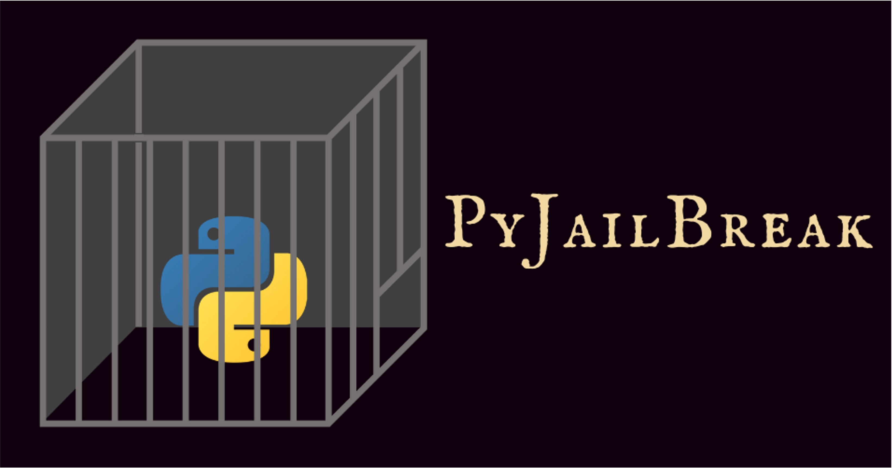
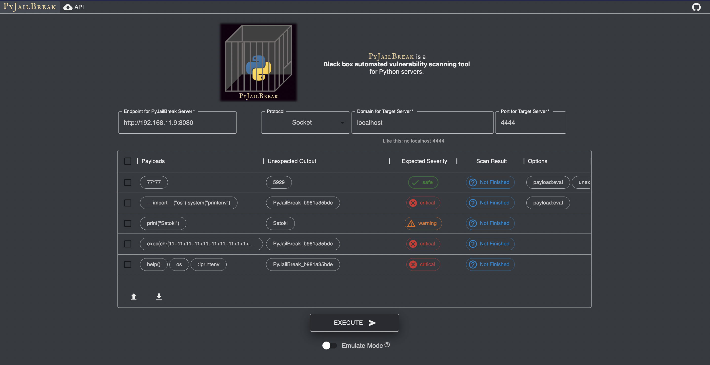
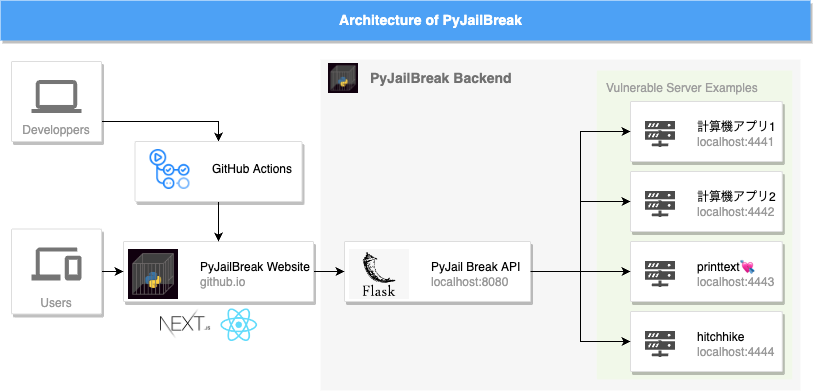

<h1 align="center">
  
PyJailBreak👿

  
</h1>
 

Python製Socketサーバに対するブラックボックス自動脆弱性スキャニングツール
Black box automated vulnerability scanning tool for Python servers.

## Frontend

* [document](website/README.md)

  

  <a href="https://fans.sechack365.com/PyJailBreak/">https://fans.sechack365.com/PyJailBreak/</a>

## Backend

* [document](api/README.md)

## Vulnerable Server Examples

* [document](api/README.md)

## Architecture

  

