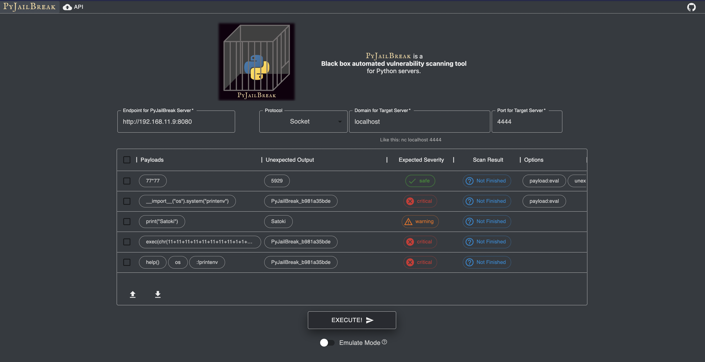

# PyJailBreak frontend

<div align="center">
  
</div>

## Install & Build

```sh
yarn
yarn build && yarn export
```

## Start Server for localhost

```sh
# Please pre-build.
cd out

# for Python User
python -m http.server 3000
# for PHP User
php -S localhost:3000
```

## Develop

```sh
yarn prepare
yarn develop
```
